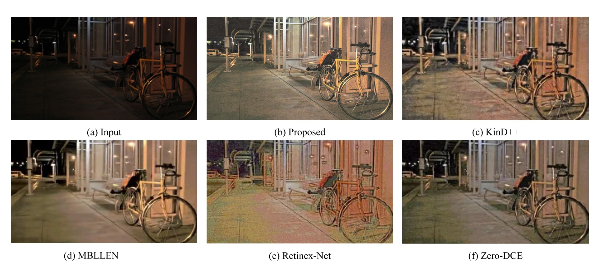
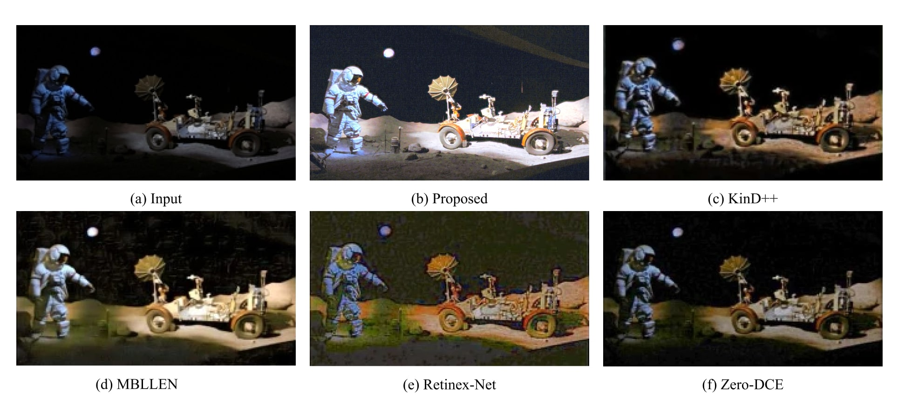

# [CDAN: Convolutional Dense Attention-guided Network for Low-light Image Enhancement](https://doi.org/10.1016/j.dsp.2024.104802)
[Hossein Shakibania](https://scholar.google.com/citations?user=huveR90AAAAJ&hl=en&authuser=1), [Sina Raoufi](https://scholar.google.com/citations?user=f0iw8XsAAAAJ&hl=en&authuser=1), and [Hassan Khotanlou](https://scholar.google.com/citations?user=5YX31NgAAAAJ&hl=en&authuser=1)

[](https://doi.org/10.48550/arXiv.2308.12902)
[](https://paperswithcode.com/sota/low-light-image-enhancement-on-lol?p=cdan-convolutional-dense-attention-guided)
<p align="justify">
<strong>Abstract:</strong> Low-light images, characterized by inadequate illumination, pose challenges of diminished clarity, muted colors, and reduced details. Low-light image enhancement, an essential task in computer vision, aims to rectify these issues by improving brightness, contrast, and overall perceptual quality, thereby facilitating accurate analysis and interpretation. This paper introduces the Convolutional Dense Attention-guided Network (CDAN), a novel solution for enhancing low-light images. CDAN integrates an autoencoder-based architecture with convolutional and dense blocks, complemented by an attention mechanism and skip connections. This architecture ensures efficient information propagation and feature learning. Furthermore, a dedicated post-processing phase refines color balance and contrast. Our approach demonstrates notable progress compared to state-of-the-art results in low-light image enhancement, showcasing its robustness across a wide range of challenging scenarios. Our model performs remarkably on benchmark datasets, effectively mitigating under-exposure and proficiently restoring textures and colors in diverse low-light scenarios. This achievement underscores CDAN's potential for diverse computer vision tasks, notably enabling robust object detection and recognition in challenging low-light conditions.
</p>
  
<p class="row" float="left" align="middle">

</p>
<p align="center"><b>Figure 1:</b> The overall structure of the proposed model.</p>

## Experimental Results
<p align="justify">
In this section, we present the experimental results obtained by training our CDAN model using the LOw-Light (LOL) dataset and evaluating its performance on multiple benchmark datasets. The purpose of this evaluation is to assess the robustness of our model across a spectrum of challenging lighting conditions. 
</p>

### Datasets
| Dataset        | No. of Images | Paired | Characteristics        |
|----------------|---------------|--------|-------------------------|
| [LOL](https://paperswithcode.com/dataset/lol)        | 500           | :white_check_mark: | Indoor |
| [ExDark](https://paperswithcode.com/dataset/exdark)     | 7363          | :x: | Extremely Dark, Indoor, Outdoor |
| [DICM](https://paperswithcode.com/dataset/dicm)       | 69           | :x: | Indoor, Outdoor |
| [VV](https://sites.google.com/site/vonikakis/datasets?authuser=0)         | 24          | :x: | Severely under/overexposed areas|

### Quantitative Evaluation
| Learning method      | Method                      | Avg. PSNR ↑  | Avg. SSIM ↑ | Avg. LPIPS ↓ |
|----------------------|-----------------------------|-------------|-------------|--------------|
| **Supervised**           | [LLNET](https://www.sciencedirect.com/science/article/abs/pii/S003132031630125X)                       | 17.959      | 0.713       | 0.360        |
|            | [LightenNet](https://www.sciencedirect.com/science/article/abs/pii/S0167865518300163)                  | 10.301      | 0.402       | 0.394        |
|           | [MBLLEN](http://bmvc2018.org/contents/papers/0700.pdf)                      | 17.902      | 0.715       | 0.247        |
|            | [Retinex-Net](https://daooshee.github.io/BMVC2018website/)                 | 16.774      | 0.462       | 0.474        |
|            | [KinD](https://dl.acm.org/doi/10.1145/3343031.3350926)                        | 17.648      | 0.779       | 0.175        |
|            | [Kind++](https://link.springer.com/article/10.1007/s11263-020-01407-x)                      | 17.752      | 0.760       | 0.198        |
|            | [TBEFN](https://ieeexplore.ieee.org/document/9261119)                       | 17.351      | 0.786       | 0.210        |
|            | [DSLR](https://ieeexplore.ieee.org/document/9264763)                        | 15.050      | 0.597       | 0.337        |
|            | [LAU-Net](https://www.sciencedirect.com/science/article/abs/pii/S092359652300053X)                     | **21.513**      | 0.805       | 0.273        |
| **Semi-supervised**      | [DRBN](https://ieeexplore.ieee.org/document/9369069)                        | 15.125      | 0.472       | 0.316        |
| **Unsupervised**         | [EnlightenGAN](https://ieeexplore.ieee.org/document/9334429)                | 17.483      | 0.677       | 0.322        |
| **Zero-shot**            | [ExCNet](https://dl.acm.org/doi/10.1145/3343031.3351069)                      | 15.783      | 0.515       | 0.373        |
|             | [Zero-DCE](https://openaccess.thecvf.com/content_CVPR_2020/papers/Guo_Zero-Reference_Deep_Curve_Estimation_for_Low-Light_Image_Enhancement_CVPR_2020_paper.pdf)                    | 14.861      | 0.589       | 0.335        |
|             | [RRDNet](https://ieeexplore.ieee.org/document/9102962)                      | 11.392      | 0.468       | 0.361        |
|                      | Proposed (CDAN)             | 20.102      | **0.816**       | **0.167**        |

### Qualitative Evaluation
<p class="row" float="left" align="middle">

</p>
<p align="center"><b>Figure 2:</b> Visual comparison of state-of-the-art models on ExDark dataset.</p>

<p class="row" float="left" align="middle">

</p>
<p align="center"><b>Figure 3:</b> Visual comparison of state-of-the-art models on DICM dataset.</p>


## Installation

To get started with the CDAN project, follow these steps:

### 1. Clone the Repository

You can clone the repository using Git. Open your terminal and run the following command:

```bash
git clone git@github.com:SinaRaoufi/CDAN.git
```
### 2. Configure Environmental Variables
<p align="justify">
After cloning, navigate to the project directory and locate the .env file. This file contains important hyperparameter values and configurations for the CDAN model. You can customize these variables according to your requirements.
</p>

Open the .env file using a text editor of your choice and modify the values as needed:
```
# Example .env file

# Directory paths
DATASET_DIR_ROOT=/path/to/your/dataset/directory
SAVE_DIR_ROOT=/path/to/your/saving/model/directory
MODEL_NAME=model

# Hyperparameters
INPUT_SIZE=200
BATCH_SIZE=32
EPOCHS=80
LEARNING_RATE=0.001
```
### 3. Install Dependencies

You can install project dependencies using pip:
```bash
pip install -r requirements.txt
```

### 4. Run the Project

You are now ready to run the CDAN project. To start the training, use the following command:

```bash
python train.py
```

To test the trained model, run:
```bash
python test.py --datasetPath "path/to/the/dataset" --modelPath "path/to/the/saved/model" --isPaired "True/False"
```

## Requirements
The following hardware and software were used for training the model:
- GPU: NVIDIA GeForce RTX 3090
- RAM: 24 GB SSD
- Operating System: Ubuntu 22.04.2 LTS
- Python version: 3.9.15
- PyTorch version: 2.0.1
- PyTorch CUDA version: 11.7


## Citation
```bibtex
@article{SHAKIBANIA2024104802,
  title = {CDAN: Convolutional Dense Attention-guided Network for Low-light Image Enhancement},
  journal = {Digital Signal Processing},
  pages = {104802},
  year = {2024},
  issn = {1051-2004},
  doi = {https://doi.org/10.1016/j.dsp.2024.104802},
  url = {https://www.sciencedirect.com/science/article/pii/S1051200424004275},
  author = {Hossein Shakibania and Sina Raoufi and Hassan Khotanlou},
}
```
